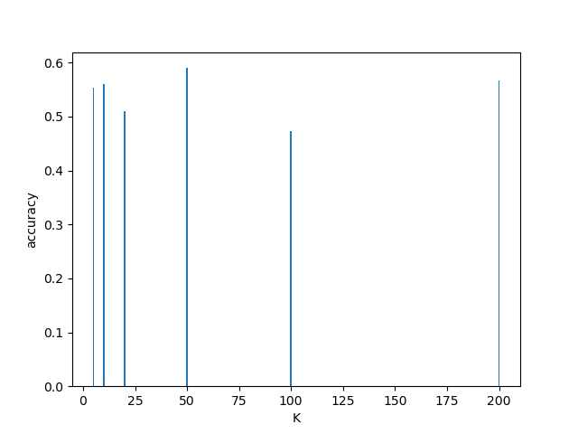

# Assignment 1 - Implement KNN

## Description:

1. funtion `pickUnseenData(df, num)` split the data into two sets T and U
2. We use euclidean distance as our distance metric in function `getDistance(ins1, ins2)`

## Performance:

_We set the size for U=60_

|  k  | average_accuracy |
| :-: | :--------------: |
| 200 |      56.67%      |
| 100 |      47.33%      |
| 50  |      59.0%       |
| 20  |      51.0%       |
| 10  |      56.0%       |
|  5  |      55.33%      |

A best K would be k=50. It does not suffer from overfitting or underfitting, and has the highest accuracy out of the presented K values.

## Implementation testing

Test with different values for neighbors k.
Test with different amounts of unknown instances U.
Test with more unknown instances than training data T.
Test with more training data T than unknown instances.

## Collaborations and Online Sources

Github used for collaboration.

## specification

python version: 3.8.6  
libraries we used: pandas, sys, random

## Accuracy with different K

</img>

